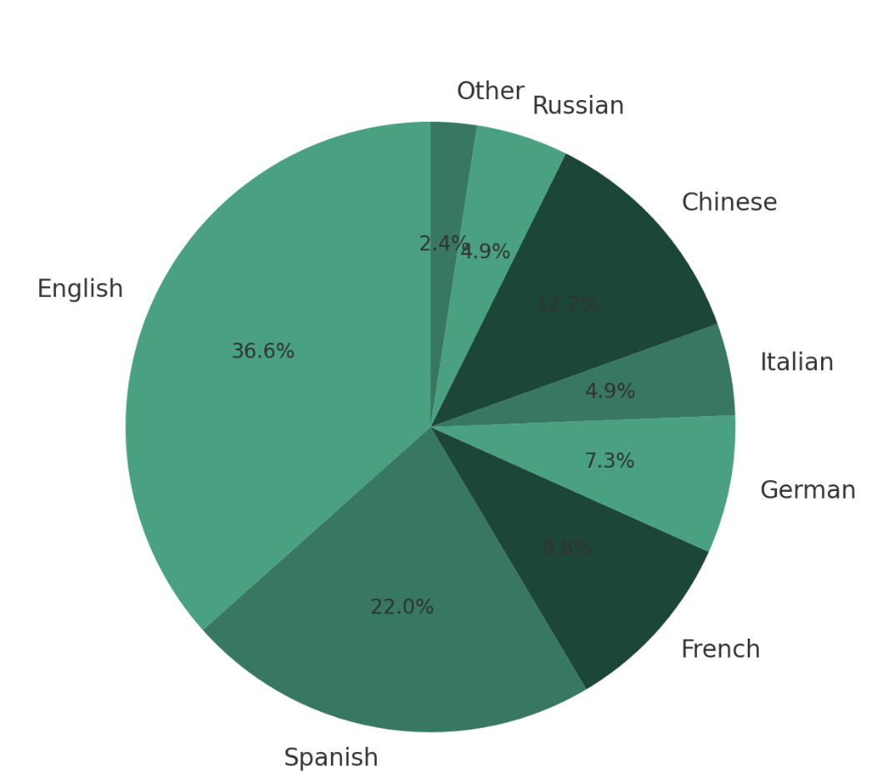

# Multilingual Clinical Notes Ingestion Project

# Introduction

In the ever-evolving landscape of global health care, effective communication and data management are paramount. With the rise of diverse patient populations and multilingual documentation, the need for a system that can seamlessly integrate and interpret clinical notes from various languages has never been more pressing. The Multilingual Clinical Notes Analysis Project represents a groundbreaking solution designed to address this challenge head on.

By integrating Health Level 7 (HL7) standards, the project ensures a smooth transition from traditional record-keeping to a more sophisticated, AI-powered data management system. The goal is to improve the efficiency of healthcare providers, enhance patient care, and unlock new insights from clinical data that were previously inaccessible due to language barriers. The Multilingual Clinical Notes Analysis Project is more than a technological innovation; it is a commitment to inclusivity and excellence in healthcare.

# Architecture

# Workflow Overview

Ingestion: HL7 messages containing clinical notes are collected and stored.
Blob Storage: Initial raw data is kept in blob storage for durability and accessibility.

Data Processing: Azure Data Factory orchestrates the transformation of data, which is then ingested into a Data Lakehouse.

NLP Enrichment: Language detection and normalization occur before GPT-4 generates summaries and embeddings of the clinical notes.

Delta Storage: The enriched data is stored in Delta tables to ensure that it is versioned and queryable.

Database Integration: The processed data is made available through Azure Cosmos DB, which is compatible with MongoDB, for easy application integration.

Here is a pie chart representing the distribution of clinical notes by language. Each slice of the pie chart corresponds to the percentage of clinical notes in a particular language, giving a visual representation of the multilingual diversity of the dataset.

  

# Gen-AI Assistant for Multilingual Clinical Notes Analysis

AI-Driven Interaction: Utilizes natural language processing to understand and respond to user queries and commands related to the clinical notes data.

Conversational Interface: Engages users in a conversational manner, allowing for an intuitive interaction experience that mimics human dialogue.

User Intent Recognition: Identifies the user's intent even with complex or ambiguous queries, ensuring that the assistance provided is aligned with the user's needs.

Error Handling: Assists users in troubleshooting issues by providing suggestions and automating corrective actions where possible.

Predictive Analytics: Uses historical data and machine learning to predict trends and outcomes, offering proactive insights to users.

Data Visualization: Generates graphs, charts, and other visual aids to help users better understand the data and insights provided by the system.

Privacy by Design: Ensures that all interactions and data handling are compliant with healthcare privacy regulations such as HIPAA.

Multi-Platform Support: Accessible via various platforms, including web interfaces, mobile applications, and even through voice-activated devices.

# Prerequisites

Before we begin, make sure we have:

An Azure account with active subscriptions.
Access to Azure Blob Storage, Data Factory, Lakehouse, and Cosmos DB services.
GPT-4 API access credentials.
Git installed on your local machine.
Python installed on your local machine (version 3.8 or higher recommended).

# Step 1: Clone the Repository
Clone the repository to your local machine using Git:

git clone [URL to the repository]
cd [repository name]

Replace [URL to the repository] with the actual URL and [repository name] with the name of the repository you cloned.

# Step 2: Install Dependencies
Navigate to the repository directory and install the required Python packages:

pip install -r requirements.txt

# Step 3: Set Up Environment Variables

Create a .env file in the root of the project directory and populate it with your service keys and endpoints:

AZURE_STORAGE_KEY="your_azure_storage_key"
AZURE_DATA_FACTORY_NAME="your_data_factory_name"
COSMOS_DB_CONNECTION_STRING="your_cosmos_db_connection_string"
GPT4_API_KEY="your_gpt4_api_key"

# Step 4: Deploy Azure Resources

Use Azure CLI to deploy the necessary Azure resources.

# Step 5: Run Data Processing Pipelines

Navigate to the Azure Data Factory interface and trigger the data processing pipelines. Alternatively, you can use the provided script to automate this:

python run_pipeline.py

# Step 6: Verify Data Ingestion and Processing

Check the Azure Lakehouse and Delta tables to ensure that data is being processed and stored correctly.

# Step 7: Accessing the Processed Data

Use the provided scripts or queries within Azure Cosmos DB to access and interact with the processed data:

python query_data.py --query "SELECT * FROM ClinicalNotes WHERE PatientID = '12345'"

# Step 8: Interact with the Gen-AI Assistant

Run the Gen-AI Assistant module to start interacting with the AI interface:

python gen_ai_assistant.py

# Troubleshooting

If you encounter any issues, please refer to the TROUBLESHOOTING.md document or open an issue in the GitHub repository for support.

